# DataCache 架构与设计迭代文档

本文档面向维护者，回答三个问题：**系统现在由哪些模块组成、各自怎么运作**（第 1–2 章）、
**关键流程在核心代码里如何实现**（第 3 章），以及**它如何一步步演变成现在的形态、
每一步迭代的动机是什么**（第 4 章）。第 3 章只摘录决定架构行为的代码，完整实现仍以
链接到的源文件为准，适合作为首次阅读代码库的入口。
用户侧的构建/运行/配置说明见 [README.md](README.md)。

---

## 1. 系统概览

DataCache 是一个 ROS2 事件触发的车载数据回流系统：相机与激光雷达数据持续流入内存环形缓存，
碰撞/急刹等事件发生时，把事件前后窗口的数据压缩落盘，后台转换为分析友好格式，
并将完整的事件目录回传到远端接收端，配套回读工具做完整性校验与导出，形成
"采集 → 缓存 → 同步 → 落盘 → 转换 → 回传 → 回读" 的完整闭环。

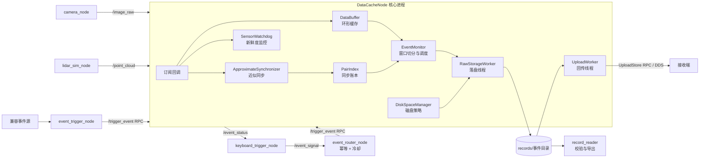

### 1.1 进程与线程模型

| 可执行文件 | 职责 | 线程 |
|---|---|---|
| `datacache_node` | 核心节点，持有全部主要模块 | 执行器线程（订阅/服务/定时器回调）+ RawStorageWorker 后台线程 + UploadWorker 后台线程 |
| `camera_node` | USB 相机采集，发布 `/image_raw` | 执行器线程 |
| `lidar_sim_node` | 回放 PCD 文件模拟雷达，发布 `/point_cloud` | 执行器线程 |
| `keyboard_trigger_node` | 原始终端按键映射为 `EventSignal`，防按键连发并显示生命周期状态 | 输入线程 + 执行器线程 |
| `event_router_node` | 可靠事件 Topic 入口，负责 `trigger_id` 幂等和按事件冷却，再调用触发 RPC | 执行器线程 |
| `event_trigger_node` | 触发代理：`/request_trigger` → `/trigger_event`，可定时自动触发 | 执行器线程 |
| `record_reader` | 离线 CLI：列出/校验/导出事件目录 | 单线程 |

关键点：**订阅回调线程上只做入队和入缓存**，序列化、zstd 压缩、JPEG/PCD 转换、
磁盘 IO、RPC 回传全部发生在专用后台线程，回调延迟与数据规模解耦。

### 1.2 四个时钟域

系统实际涉及四种时间来源，混用会导致窗口切错、清理误删或看门狗失明：

| 时钟 | 用途 | 使用者 |
|---|---|---|
| `header.stamp`（传感器时间域） | 缓存条目、配对记录、事件窗口边界的统一键 | DataBuffer、PairIndex、EventMonitor 窗口切分 |
| `steady_clock`（单调时间） | 接收新鲜度、上传重试退避、清理节流 | SensorWatchdog、UploadWorker、DiskSpaceManager |
| `rclcpp::Clock`（节点时钟） | 无传感器数据时的事件窗口兜底 | EventMonitor |
| `system_clock`（系统墙钟） | 事件目录命名、按目录名计算保留天数 | EventMonitor、DiskSpaceManager |

事件窗口边界用“缓存内最新 `header.stamp`”而不是节点时钟计算，避免节点时钟与
传感器时钟偏移导致切片错位；目录名使用单调序号 + `system_clock` 纳秒值，
即使同一传感器帧上连续触发也不会覆盖，且与保留策略处于同一时间域。

---

## 2. 模块运作方式

本章每节均按“职责说明 → 模块图 → 核心代码”的顺序组织。代码片段用于展示决定架构行为的
主控制流，可能省略日志、局部变量初始化和重复的错误处理；需要修改实现时，应继续打开标题中
标注的源文件阅读完整上下文。

### 2.1 数据模型 — [`include/data.hpp`](include/data.hpp)

`CameraData` / `LidarData` 各自带 `rclcpp::Time`（取自 `header.stamp`）和消息共享指针，
用 `std::variant` 包装成 `SensorData` + `SensorType` 枚举。下游模块（DataBuffer、
EventMonitor、RawStorageWorker）通过同一个 `timestampOf(SensorData)` 访问器取时间戳，
保证"传感器时间域"的语义只在一处定义。

**模块图**

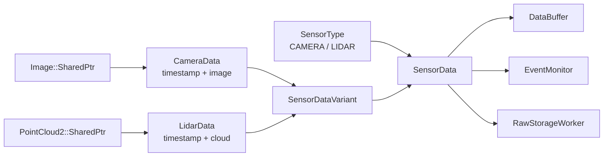

**核心代码**

```cpp
// include/data.hpp
struct CameraData {
    rclcpp::Time timestamp;
    sensor_msgs::msg::Image::SharedPtr image;
};

struct LidarData {
    rclcpp::Time timestamp;
    sensor_msgs::msg::PointCloud2::SharedPtr cloud;
};

using SensorDataVariant = std::variant<CameraData, LidarData>;
struct SensorData {
    SensorType type;
    SensorDataVariant data;
};
```

### 2.2 ConfigManager — [`include/config_manager.hpp`](include/config_manager.hpp) / [`src/config_manager.cpp`](src/config_manager.cpp)

极简的 `key=value` 文本解析（`#` 注释、两侧 trim），`getIntConfig` / `getBoolConfig`
带类型化默认值；整数解析失败会告警并回退，非法布尔值直接回退默认值，
**保证配置文件残缺时系统仍以安全默认值启动**。

事件级配置在 EventMonitor 中实现三级回退（`getEventIntConfig`，event_monitor.hpp:241）：

```
event_<name>_<suffix>  →  event_<suffix>  →  代码默认值
例: event_collision_pre_time → event_pre_time → 5
```

这使得"每个事件可以有专属的窗口长度和传感器选择，不配则用全局值"。

**模块图**

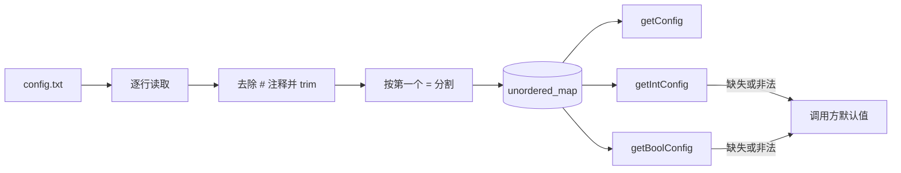

**核心代码**

```cpp
// src/config_manager.cpp
while (std::getline(configFile, line)) {
    const auto commentPosition = line.find('#');
    if (commentPosition != std::string::npos) {
        line.erase(commentPosition);
    }
    std::stringstream stream(line);
    std::string key;
    std::string value;
    if (std::getline(stream, key, '=') && std::getline(stream, value)) {
        config_[trim(key)] = trim(value);
    }
}
```

事件配置的三级回退由 EventMonitor 完成：

```cpp
int getEventIntConfig(const std::string& eventName,
                      const std::string& suffix,
                      const std::string& fallbackKey,
                      int defaultValue) const {
    const auto eventKey = "event_" + eventName + "_" + suffix;
    return configManager_->getIntConfig(
        eventKey,
        configManager_->getIntConfig(fallbackKey, defaultValue));
}
```

### 2.3 DataBuffer — [`include/databuffer.hpp`](include/databuffer.hpp)

按条数 + 年龄双约束的环形缓存，**每类传感器一条独立 `std::deque`**。

- **条数淘汰**：每队列超过 `buffer_size` 即队首弹出。
- **年龄淘汰**：维护全局水位 `latestTimestamp_`（所有传感器中最新时间戳），
  每次插入后把各队列队首 `< 水位 - maxAge` 的数据连续弹出。
  到达序 ≈ 时间戳序，因此过期数据在队首连续分布，队首弹出即可覆盖。
- **晚到拒收**：落后水位超过 `maxAge` 的乱序帧直接不入队——水位推进时它必然被淘汰，
  入队只是浪费。
- `latestSensorTimestamp()` 把"缓存视角的现在"暴露给 EventMonitor，作为事件时间锚点。

每条消息的插入成本是摊还 O(1)，与缓存规模无关（这是最后一轮性能迭代的产物，见 4.7 节）。

**模块图**

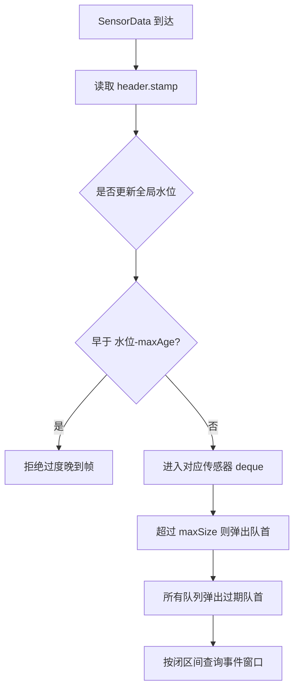

**核心代码**

```cpp
// include/databuffer.hpp
const auto timestamp = timestampOf(data);
if (!hasLatestTimestamp_ || timestamp > latestTimestamp_) {
    latestTimestamp_ = timestamp;
    hasLatestTimestamp_ = true;
}
if (maxAge_.nanoseconds() > 0 &&
    timestamp < latestTimestamp_ - maxAge_) {
    return;
}
auto& queue = queues_[data.type];
queue.push_back(std::move(data));
while (queue.size() > maxSize_) queue.pop_front();
evictExpiredLocked();
```

### 2.4 ApproximateSynchronizer — [`include/approximate_synchronizer.hpp`](include/approximate_synchronizer.hpp)

相机/雷达按时间戳近似配对，输出 matched 对与丢弃记录。

- **front 贪心配对**（`tryMatchLocked`，approximate_synchronizer.hpp:119）：两侧队列按
  时间戳有序，比较两个队首：差值 ≤ 容差则配对弹出；否则丢掉**更老的一侧**——
  由于有序性，老消息与未来任何对侧消息的差值只会更大，永不可能配对。
  单次到达摊还 O(1)，取代了最初的 O(N·M) 全扫描。
- **队列上限**：任一侧超过 `sync_queue_size` 丢队首并计数。
- **锁外派发**：匹配/丢弃结果先积累在栈上的 `PendingResults`，释放锁后再回调。
  回调会写 PairIndex 和日志 IO，绝不能在同步器互斥量内执行。
- **`flushUnmatched()`**：事件边界显式清算——还在等对侧的悬挂消息记为 single-sided，
  但消息本体仍在 DataBuffer 中（清账不清数据）。

**模块图**

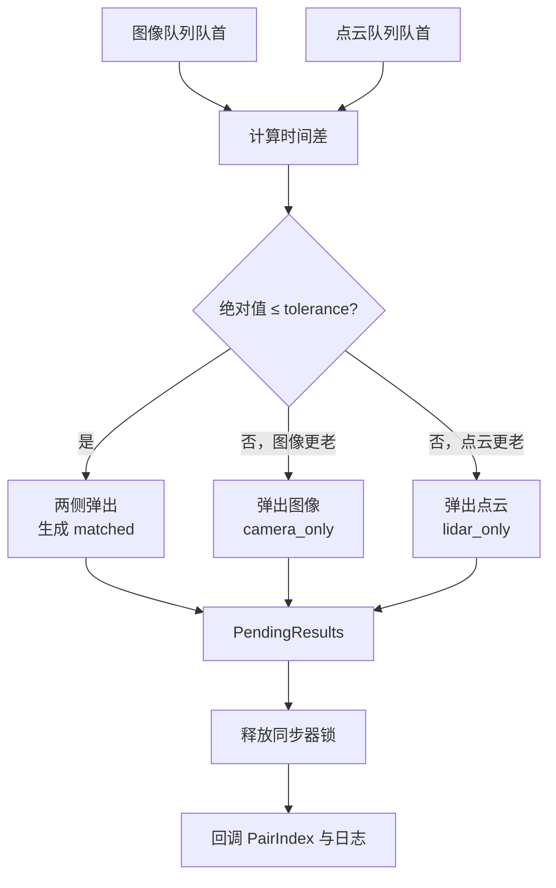

**核心代码**

```cpp
// include/approximate_synchronizer.hpp
const auto difference =
    (stamp(images_.front()) - stamp(clouds_.front())).nanoseconds();
if (std::llabs(difference) <= tolerance_.nanoseconds()) {
    results.matches.push_back({images_.front(), clouds_.front(),
        rclcpp::Duration::from_nanoseconds(std::llabs(difference))});
    images_.pop_front();
    clouds_.pop_front();
} else if (difference < 0) {
    recordDrop(results.drops, "camera", stamp(images_.front()),
               "outside synchronization tolerance");
    images_.pop_front();
} else {
    recordDrop(results.drops, "lidar", stamp(clouds_.front()),
               "outside synchronization tolerance");
    clouds_.pop_front();
}
```

### 2.5 PairIndex — [`include/pair_index.hpp`](include/pair_index.hpp)

同步账本：每个 matched 对或 single-sided 丢弃都是一条 `PairRecord`（pairId 递增、
双侧时间戳、差值、状态、原因）。用途有两个：落盘为 `pairs.csv` 供离线分析同步质量；
`getDataWithinTimeRange` 供 EventMonitor 在事件窗口内查询配对情况
（`sync_required_for_recording` 严格模式据此拒绝事件）。

账本上限 10 万条，超出从 deque 队首裁剪——每条 O(1)。
（最初是 `vector` 前端 erase，上限处每条记录引发 ~10MB 整段搬移。）

**模块图**

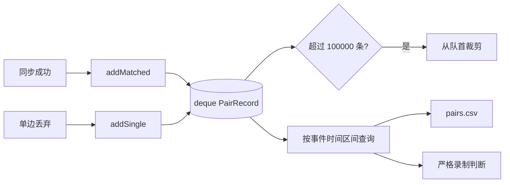

**核心代码**

```cpp
// include/pair_index.hpp
void addMatched(const rclcpp::Time& camera,
                const rclcpp::Time& lidar,
                const rclcpp::Duration& difference) {
    std::lock_guard<std::mutex> lock(mutex_);
    records_.push_back(PairRecord{nextId_++, true, true,
        camera, lidar, difference, "matched", ""});
    trim();
}

void trim() {
    constexpr std::size_t maxRecords = 100000;
    while (records_.size() > maxRecords) records_.pop_front();
}
```

### 2.6 EventMonitor — [`include/event_monitor.hpp`](include/event_monitor.hpp)

事件编排核心：注册事件、切窗口、调度 post 窗口、管理存储队列资源。

**触发主流程**（`recordDataAroundEvent`，event_monitor.hpp:74）：

1. `flushPendingPairs_()`：先清算同步器悬挂消息，保证账本完整。
2. 解析 pre/post 秒数（事件级 → 全局级 → 默认值三级回退）。
3. **事件时间锚定在传感器时间域**：`eventTime = dataBuffer_->latestSensorTimestamp()`，
   无传感器数据时退化为墙钟并告警。窗口 = `[eventTime - pre, eventTime]` + post 段。
4. `sync_required_for_recording` 开启时，检查 pre 窗口内是否存在 matched 配对，
   无则拒绝该事件（返回 false，触发方收到明确失败）。
5. `postSeconds = 0`：pre 窗口数据一次性入队，`finalJob=true`，流程结束。
6. 有 post 窗口：先 `storageWorker_->reserve()` **预约一个存储槽位**（防止 post 数据
   到期时队列被占满），再把 `EventCaptureTask` 放进 `activeCaptures_`（受
   `max_active_event_captures` 上限约束），最后入队 pre 批数据。pre 批入队失败则
   回滚：删除任务、释放预约、拒绝事件。

**post 窗口收割**（`processExpiredCaptures`，event_monitor.hpp:161）：
50ms 周期定时器扫描 `activeCaptures_`，任务到期条件满足即收割：

- 正常条件：最新传感器时间戳 ≥ `endTime`（传感器时间域）。
- 兜底条件：墙钟 ≥ `wallDeadline = 触发墙钟 + post + sensor_stall_grace_ms`——
  传感器时间戳停滞（设备挂了）也不会把捕获任务永久钉死在内存里。

收割时拉取 `[eventTime, endTime]` 的数据和配对，**剔除 eventTime 边界上的记录**
（pre 批已含该闭区间边界帧，不剔除会写两次：同名文件被覆盖、manifest 出现重复行），
以 `reserved=true, finalJob=true` 入队。

**模块图**

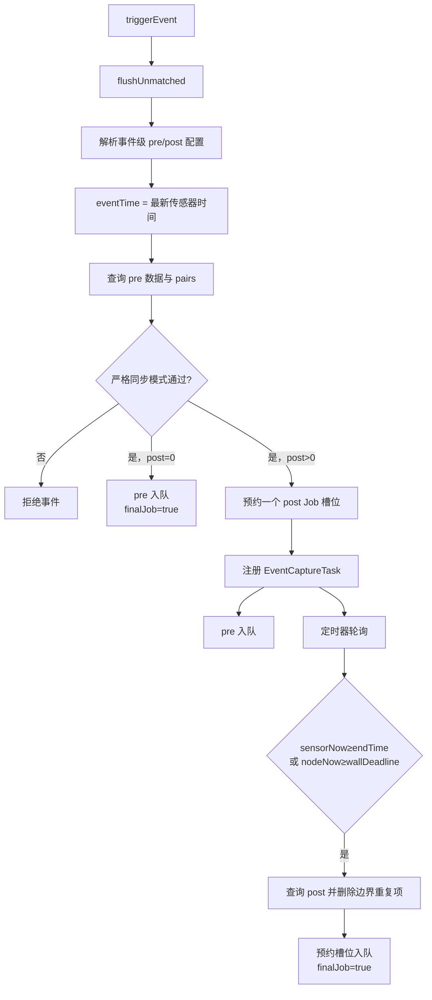

**核心代码**

```cpp
// include/event_monitor.hpp
const auto wallNow = clock_->now();
const auto sensorNow = dataBuffer_->latestSensorTimestamp();
const auto eventTime = sensorNow.value_or(wallNow);
const auto startTime = eventTime -
    rclcpp::Duration::from_seconds(preSeconds);

if (postSeconds <= 0) {
    return enqueueRecords(eventDirectory, eventName,
        dataBuffer_->getDataWithinTimeRange(startTime, eventTime),
        std::move(preWindowPairs), false, true);
}

if (!storageWorker_->reserve()) return false;
activeCaptures_.emplace(task.taskId, std::move(task));
return enqueueRecords(eventDirectory, eventName,
    dataBuffer_->getDataWithinTimeRange(startTime, eventTime),
    std::move(preWindowPairs));
```

到期判定只在锁内移动任务，不在 `captureMutex_` 内查询缓存或入队：

```cpp
const bool postWindowComplete =
    sensorNow.has_value() && *sensorNow >= it->second.endTime;
if (postWindowComplete || wallNow >= it->second.wallDeadline) {
    expired.push_back(std::move(it->second));
    it = activeCaptures_.erase(it);
}
```

### 2.7 RawStorageWorker — [`include/raw_storage_worker.hpp`](include/raw_storage_worker.hpp)

单后台线程消费 `jobs_` 队列（`condition_variable` 唤醒），每个 Job 携带一批
SensorData、配对记录和当次生效的全部配置快照（压缩/转换开关与参数随 Job 走，
避免 Worker 反查配置）。写入流程（`writeJob`，raw_storage_worker.hpp:295）：

1. **写前磁盘检查**：`diskManager_->prepareForWrite()`，不足则整批丢弃并报错。
2. 建目录、以追加模式打开 `manifest.csv`（首行写表头）。
3. 每条记录：
   - CDR 序列化（`rclcpp::Serialization`）得到原始字节；
   - zstd 压缩（**复用 `ZSTD_CCtx`**、**帧尾开启 XXH64 校验和**——默认
     `ZSTD_compress` 不写校验和，静默位腐只有解压时才能发现）；
   - `.tmp` 写入 → `fsync` → `rename` → `fsync` 父目录（`writeAtomically`，
     raw_storage_worker.hpp:172）。崩溃不留半文件；掉电时数据块不会晚于目录项可见；
   - 压缩失败回落写未压缩 `.bin`，manifest 的 `encoding` 列如实记录 `zstd`/`raw`；
   - 可选后台转换：OpenCV 编码 jpg（bgr8/rgb8/mono8/bgra8/rgba8）、PCL 写
     binary-compressed pcd，同样走临时文件 + rename；
   - 追加 manifest 行。
4. `pairs.csv` 同样以追加模式写入本批配对。
5. **`finalJob` 的顺序保证**：manifest 先 `flush()` 越过用户态缓冲、再 `fsync`
   越过页缓存，**然后**才原子写入 `.complete` 标记（内含 records 计数）；当前 final
   Job 自身带有 pairs 时也会同步 `pairs.csv`。若标记先于清单落盘，进程在窗口内崩溃
   会留下“标记完整但 manifest 尾行缺失”的目录，上传器会把残缺目录当完整数据发走。
6. 最后 `enforceRetention()` 做节流后的保留清理。

**队列与预约**：`max_pending_storage_jobs` 上限；普通入队检查
`jobs_ + reservedJobs_ >= 上限`；`reserve()`/`releaseReservation()` 维护预约计数，
EventMonitor 用它保证 post 批到期时必有槽位（预约本身也计入满员判断，
普通数据无法把预约槽位挤掉）。

**模块图**

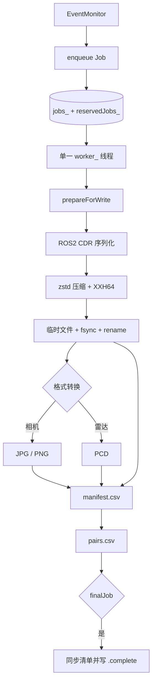

**核心代码**

```cpp
// include/raw_storage_worker.hpp
void run() {
    while (true) {
        Job job;
        {
            std::unique_lock<std::mutex> lock(mutex_);
            condition_.wait(lock,
                [this]() { return stopping_ || !jobs_.empty(); });
            if (jobs_.empty() && stopping_) return;
            job = std::move(jobs_.front());
            jobs_.pop_front();
        }
        writeJob(job);  // 序列化、压缩、转换、IO 全部在锁外
    }
}
```

原子写协议集中在一个函数里，所有二进制记录和完成标记复用它：

```cpp
static bool writeAtomically(const std::filesystem::path& target,
                            const void* data, std::size_t size) {
    const auto temporary = target.string() + ".tmp";
    std::ofstream output(temporary, std::ios::binary | std::ios::trunc);
    output.write(static_cast<const char*>(data),
                 static_cast<std::streamsize>(size));
    output.close();
#ifndef _WIN32
    syncFile(temporary);
#endif
    std::error_code error;
    std::filesystem::rename(temporary, target, error);
#ifndef _WIN32
    syncDirectory(target.parent_path());
#endif
    return !error;
}
```

### 2.8 DiskSpaceManager — [`include/disk_space_manager.hpp`](include/disk_space_manager.hpp)

只被 RawStorageWorker 的后台线程调用，因此**全类无锁**。

- `prepareForWrite()`：剩余空间 ≥ `disk_min_free_mb` 放行；不足则强制清理后复查，
  仍不足返回 false（该批数据丢弃，录制失败显式上报而非写坏盘）。
- `enforceRetention()`：天数策略（目录时间戳 < now - `retention_days` 删除）+
  容量策略（records 总量超 `retention_max_capacity_mb` 从最旧删起），按
  `disk_cleanup_interval_seconds` 节流。
- **只认末尾为纳秒时间戳的事件目录**（当前命名为 `<event>_<sequence>_<system_ns>`；
  `parseEventTimestamp` 取最后一个 `_`
  之后的纯数字段、至少 9 位，事件名本身可含 `_` 如 hard_brake）。命名不匹配的
  目录一律不动，避免误删人工放入的数据。
- 目录时间戳与年龄计算都使用 `system_clock`，不受 `use_sim_time` 影响。

**模块图**

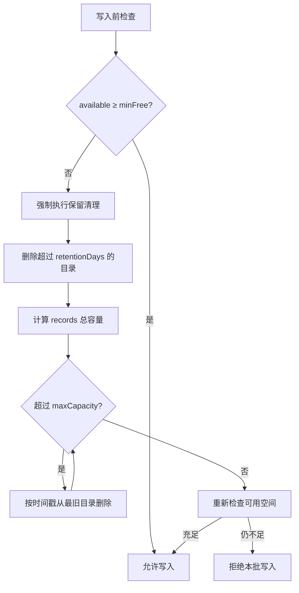

**核心代码**

```cpp
// include/disk_space_manager.hpp
bool prepareForWrite() {
    if (policy_.minFreeBytes == 0 ||
        availableBytes() >= policy_.minFreeBytes) {
        return true;
    }
    enforceRetention(true);
    return availableBytes() >= policy_.minFreeBytes;
}

void enforceRetention(bool force = false) {
    if (!force && std::chrono::steady_clock::now() - lastSweep_
                      < policy_.cleanupInterval) {
        return;
    }
    auto eventDirs = collectEventDirs();  // 已按目录时间戳升序
    // 先执行天数策略，再从 eventDirs 队首执行容量策略。
}
```

### 2.9 SensorWatchdog — [`include/sensor_watchdog.hpp`](include/sensor_watchdog.hpp)

接收时间（steady_clock）新鲜度监控，**刻意不看 `header.stamp`**：设备时钟冻结或跳变
时 header.stamp 表现"正常"，只有到达时间能暴露真实断流。

- 注册即开始计时——从未发布过数据的传感器超时后同样会被标记。
- `poll()` 由节点 wall_timer 周期驱动，**状态翻转才触发回调**（stale→fresh、
  fresh→stale 各一次），不是每次轮询都刷日志。
- `describeStatus()` 生成 `"camera: ok, lidar: STALE 2.3s"` 快照，
  附加到触发服务响应里，触发方立刻知道这次录的数据有多完整。

**模块图**

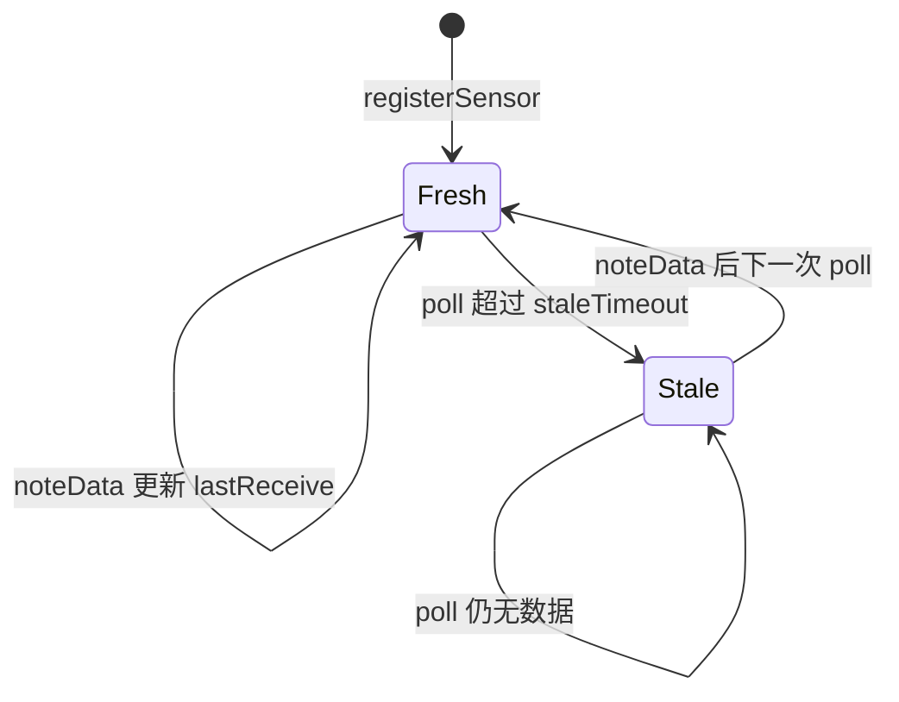

**核心代码**

```cpp
// include/sensor_watchdog.hpp
void noteData(const std::string& name) {
    std::lock_guard<std::mutex> lock(mutex_);
    const auto sensor = sensors_.find(name);
    if (sensor != sensors_.end()) {
        sensor->second.lastReceive = std::chrono::steady_clock::now();
    }
}

const bool stale = now - state.lastReceive > state.staleTimeout;
if (stale != state.stale) {
    state.stale = stale;
    transitions.push_back({name, stale, elapsed});
}
// TransitionCallback 在释放 mutex_ 后执行。
```

### 2.10 UploadWorker — [`include/upload_worker.hpp`](include/upload_worker.hpp)

独立后台线程，**通过文件系统标记与存储模块协作，互相不持有引用**：

```
扫描: record_root 下带 .complete、且无 .uploaded / 活跃 .uploading 租约的目录
回传: 递归收集普通文件(排除点开头的标记与 .tmp), 通过 UploadStore RPC 分块传输
成功: 接收端校验文件数/字节数后写 .uploaded (记录 service 与文件数)
失败: 指数退避重试 backoff * 2^(n-1) 封顶 64 倍; 超过 max_retries 写 .upload_failed，
      默认按 upload_failed_rescan_period_ms 重新排队（0 才是永久失败）
```

实现细节：每个目录按 `BEGIN → FILE_CHUNK* → END` 调用服务，文件块默认 512 KiB、
接口上限 1 MiB；RPC future 由 DataCacheNode 所在执行器推进，后台线程等待响应，
停止时每 100 ms 检查退出信号并移除未完成请求。接收端只在 END 校验通过后发布
暂存目录。本地数据永不删除，磁盘回收完全交给 DiskSpaceManager——**回传与清理职责分离**。

**模块图**

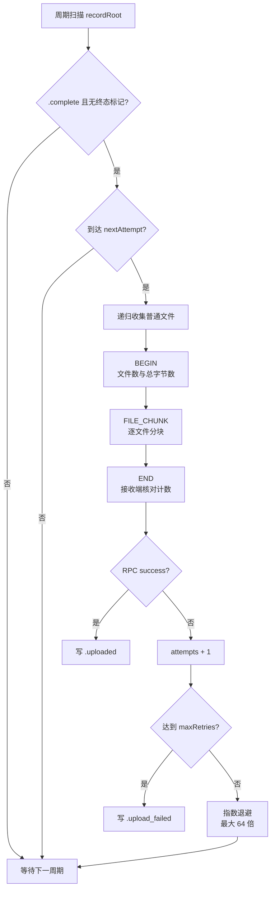

**核心代码**

```cpp
// include/upload_worker.hpp
for (const auto& directory : findUploadCandidates()) {
    const auto state = pending_.find(directory.string());
    if (state != pending_.end() && now < state->second.nextAttempt) {
        continue;
    }
    if (uploadDirectory(directory)) {
        pending_.erase(directory.string());
        continue;
    }
    auto& state = pending_[directory.string()];
    ++state.attempts;
    const auto delay = config_.retryBackoff *
        (1LL << std::min(state.attempts - 1, 6));
    state.nextAttempt = now + delay;
}
```

完整实现只在访问 `pending_` 时持有互斥量，而实际 RPC 调用在锁外执行，见
[`include/upload_worker.hpp`](include/upload_worker.hpp)。

### 2.11 record_io 与 record_reader — [`include/record_io.hpp`](include/record_io.hpp) / [`src/record_reader.cpp`](src/record_reader.cpp)

`include/record_io.hpp` 是回读共享库，**CLI 工具与单元测试共用同一份实现**，
从结构上保证"写得出就读得回"：

- CSV 解析：撕裂/畸形行记入 `problems` 上报而非抛异常（`std::stoll` 对空串/垃圾
  会抛）；整数解析拒绝残留垃圾与溢出。
- zstd 解压：帧内容大小已知时一次性解压，未知时流式兜底，可检测截断帧；
  XXH64 校验和在解压时自动验证。
- `verifyEventDirectory()` 逐条校验：文件存在 → 可解压 → CDR 反序列化 →
  消息字段自洽（图像 `step*height ≤ data.size()`、点云 `width*height*point_step ≤
  data.size()`），撕裂的 CSV 行本身计为失败。`record_reader --verify` 损坏返回
  退出码 2，可直接接入脚本判断。

**模块图**

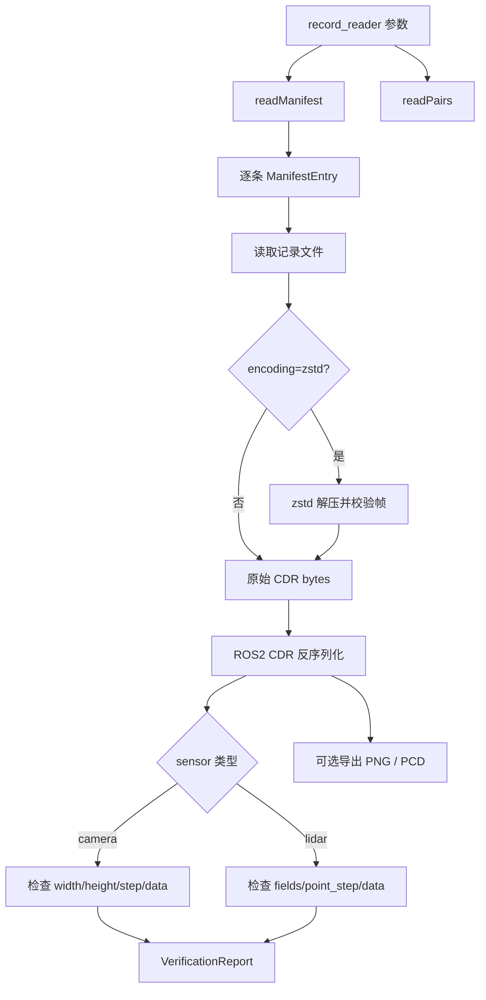

**核心代码**

```cpp
// include/record_io.hpp
if (!loadRecordBytes(eventDirectory, entry, bytes, error)) {
    ++report.failedEntries;
    report.problems.push_back(label + ": " + error);
    continue;
}

if (entry.sensor == "camera") {
    sensor_msgs::msg::Image image;
    if (!deserializeMessage(bytes, image, error) ||
        image.width == 0 || image.height == 0 || image.step == 0 ||
        image.step * image.height > image.data.size()) {
        ++report.failedEntries;
        continue;
    }
}
```

zstd 同时支持已知内容大小的一次性解压和未知大小的流式兜底：

```cpp
const auto contentSize = ZSTD_getFrameContentSize(data, size);
if (contentSize != ZSTD_CONTENTSIZE_ERROR &&
    contentSize != ZSTD_CONTENTSIZE_UNKNOWN) {
    out.resize(static_cast<std::size_t>(contentSize));
    const auto decoded = ZSTD_decompress(out.data(), out.size(), data, size);
    if (ZSTD_isError(decoded)) return false;
    out.resize(decoded);
    return true;
}
// 否则进入 ZSTD_decompressStream 循环，并检测截断帧。
```

### 2.12 外围节点 — [`src/`](src)

- **camera_node**：OpenCV `VideoCapture` 定时采帧，cv_bridge 转 `bgr8` Image。
  依赖真实 USB 设备，无相机时用 `test/test_camera_publisher.py`（30fps 合成图案）替代。
- **lidar_sim_node**：启动时加载一个 PCD 到内存，定时以当前时间戳重发
  `PointCloud2`。
- **event_trigger_node**：对外提供 `/request_trigger`（转发给 datacache_node 的
  `/trigger_event`）与可选定时自动触发。触发请求走 `async_send_request` + 完成回调——
  早期版本在回调里同步 `spin_until_future_complete`，节点已在执行器里 spin，
  重入直接崩溃（见 4.1 节）。

**模块图**

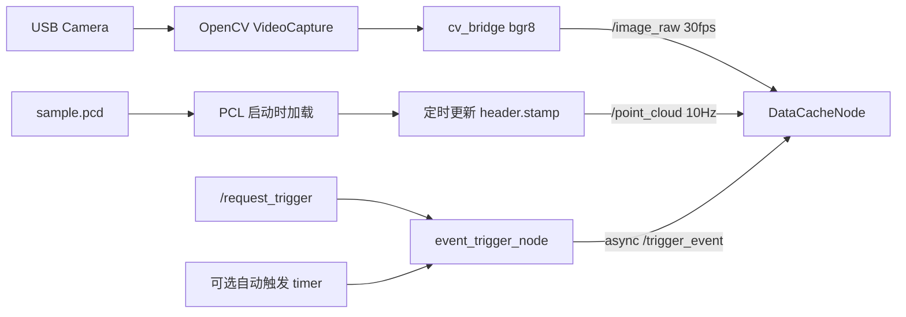

**核心代码**

```cpp
// src/camera_node.cpp
void captureAndPublish() {
    cv::Mat frame;
    if (!capture_.read(frame) || frame.empty()) return;
    auto msg = cv_bridge::CvImage(
        std_msgs::msg::Header(), "bgr8", frame).toImageMsg();
    msg->header.stamp = now();
    msg->header.frame_id = "camera_frame";
    publisher_->publish(*msg);
}
```

```cpp
// src/lidar_sim_node.cc
void publishCloud() {
    cloudMsg_.header.stamp = now();
    publisher_->publish(cloudMsg_);
}
```

触发代理不能在执行器回调里同步重入 spin，因此使用完成回调：

```cpp
// src/event_trigger_node.cc
client_->async_send_request(request,
    [this](rclcpp::Client<datacache::srv::EventTrigger>::SharedFuture future) {
        const auto result = future.get();
        if (result->success) {
            RCLCPP_INFO(get_logger(), "%s", result->message.c_str());
        }
    });
```

### 2.13 工具与测试 — [`tools/`](tools) / [`test/`](test)

- `tools/receiver_node.py`：`UploadStore` RPC 接收端，暂存目录并核对 `manifest.sha256`，
  用于回传闭环验证；安装后可通过 `ros2 run datacache upload_receiver_node` 启动。
- `tools/smoke_test.sh`：端到端冒烟——起 RPC 接收端与雷达仿真、触发事件、跑
  `record_reader --verify/--export`、验证 `.uploaded` 与接收端落盘。
- `tools/vm_exec.py`：向验证用 Ubuntu VM 传文件/执行命令（凭据走环境变量）。
- 单元测试 8 个 gtest 套件 + 1 个 pytest 套件，共 48 用例：ConfigManager、DataBuffer、PairIndex、
  ApproximateSynchronizer、record_io、UploadWorker（进程内起 ROS2 RPC service）、
  ReceiverNode（暂存发布/重复块/空文件/路径校验）、EventMonitor
  （窗口切分/双时钟到期/预约回滚/严格模式/并发上限）、DiskSpaceManager。
- 集成测试 `test/run_integration_test.sh` + `validate_records.py`：全链路起节点、
  触发双事件、对产物做结构化断言。

**模块图**

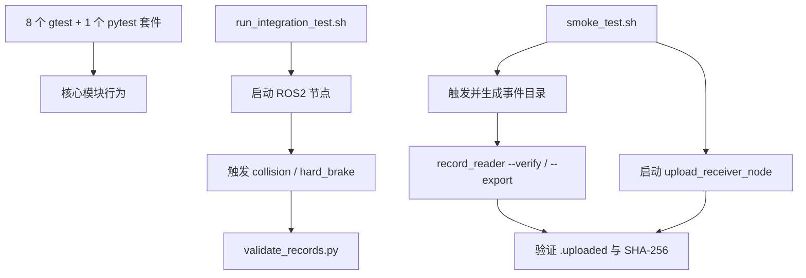

**核心代码/执行入口**

```cmake
# CMakeLists.txt
datacache_add_test(test_data_buffer test/test_data_buffer.cpp)
datacache_add_test(test_pair_index test/test_pair_index.cpp)
datacache_add_test(test_approximate_synchronizer
                   test/test_approximate_synchronizer.cpp)
datacache_add_test(test_record_io test/test_record_io.cpp)
datacache_add_test(test_disk_space_manager test/test_disk_space_manager.cpp)
datacache_add_test(test_event_monitor
                   test/test_event_monitor.cpp src/config_manager.cpp)
datacache_add_test(test_upload_worker test/test_upload_worker.cpp)
ament_add_pytest_test(test_receiver_node test/test_receiver_node.py)
```

```bash
# 已构建并 source ROS2 环境后
colcon test && colcon test-result --verbose
bash tools/smoke_test.sh
```

---

## 3. 核心代码伴读与数据流走查

本章按“装配 → 热路径 → 事件编排 → 持久化 → 回传/回读”的执行顺序阅读。
代码片段刻意省略日志和不影响控制流的配置项；标题中的链接可直接跳到完整实现。

### 3.1 核心对象如何装配

入口构造函数按依赖顺序完成配置、核心组件、看门狗、上传器、事件、订阅和服务的装配。
这也是阅读 `datacache_node` 的推荐顺序。

```cpp
// src/datacache_node.cpp
DataCacheNode::DataCacheNode() : Node("datacache_node") {
    declare_parameter<std::string>("config_path", "config.txt");
    configPath_ = get_parameter("config_path").as_string();

    loadConfiguration();
    createCoreComponents();
    createWatchdog();
    createUploader();
    registerEvents();
    createSubscriptions();
    createTriggerService();
}
```

核心对象的所有权集中在 `DataCacheNode`：Buffer 和 Index 被多个模块共享；Worker 的生命周期
则由 EventMonitor/节点独占管理。

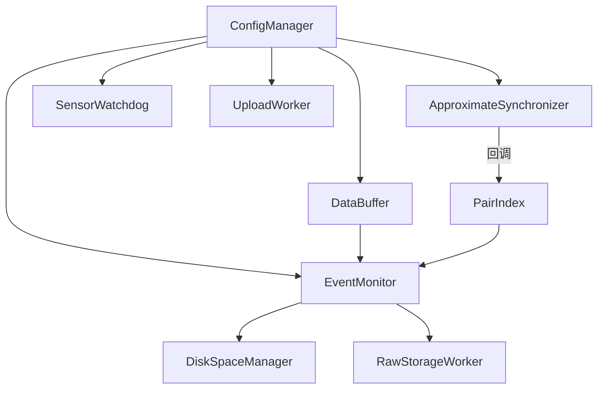

同步器不直接依赖 PairIndex，而是通过构造时注入的回调写账本；EventMonitor 同样通过
`flushPendingPairs` 回调清算同步器。这两处回调让底层类保持可单测、可替换。
完整代码见 [`src/datacache_node.cpp`](src/datacache_node.cpp) 与
[`include/datacache_node.hpp`](include/datacache_node.hpp)。

### 3.2 一条消息的热路径

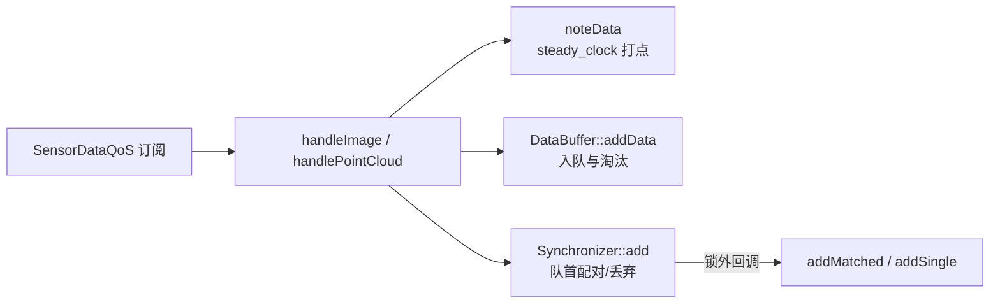

两个回调结构完全对称：先记录接收新鲜度，再把同一消息分别交给原始缓存和同步器。

```cpp
// src/datacache_node.cpp
void DataCacheNode::handleImage(sensor_msgs::msg::Image::SharedPtr message) {
    if (watchdog_) {
        watchdog_->noteData("camera");
    }
    dataBuffer_->addData({SensorType::CAMERA,
                          CameraData{message->header.stamp, message}});
    if (syncEnabled_) {
        synchronizer_->addImage(message);
    }
}

void DataCacheNode::handlePointCloud(
    sensor_msgs::msg::PointCloud2::SharedPtr message) {
    if (watchdog_) {
        watchdog_->noteData("lidar");
    }
    dataBuffer_->addData({SensorType::LIDAR,
                          LidarData{message->header.stamp, message}});
    if (syncEnabled_) {
        synchronizer_->addPointCloud(message);
    }
}
```

`DataBuffer::addData` 的核心是“先推进全局传感器时间水位，再执行条数和年龄淘汰”。

```cpp
// include/databuffer.hpp
void addData(SensorData data) {
    std::lock_guard<std::mutex> lock(mutex_);
    if (maxSize_ == 0) return;

    const auto timestamp = timestampOf(data);
    if (!hasLatestTimestamp_ || timestamp > latestTimestamp_) {
        latestTimestamp_ = timestamp;
        hasLatestTimestamp_ = true;
    }
    if (maxAge_.nanoseconds() > 0 &&
        timestamp < latestTimestamp_ - maxAge_) {
        return;                         // 过度晚到的数据不再入队
    }

    auto& queue = queues_[data.type];
    queue.push_back(std::move(data));
    while (queue.size() > maxSize_) queue.pop_front();
    evictExpiredLocked();
}
```

同步器只比较两个有序队列的队首；匹配和丢弃结果在互斥量外派发。

```cpp
// include/approximate_synchronizer.hpp
void tryMatchLocked(PendingResults& results) {
    while (!images_.empty() && !clouds_.empty()) {
        const auto difference =
            (stamp(images_.front()) - stamp(clouds_.front())).nanoseconds();
        if (std::llabs(difference) <= tolerance_.nanoseconds()) {
            results.matches.push_back({images_.front(), clouds_.front(),
                rclcpp::Duration::from_nanoseconds(std::llabs(difference))});
            images_.pop_front();
            clouds_.pop_front();
        } else if (difference < 0) {
            recordDrop(results.drops, "camera", stamp(images_.front()),
                       "outside synchronization tolerance");
            images_.pop_front();
        } else {
            recordDrop(results.drops, "lidar", stamp(clouds_.front()),
                       "outside synchronization tolerance");
            clouds_.pop_front();
        }
    }
}
```

因此消息热路径没有序列化、压缩、磁盘 IO 或 RPC，单条消息的处理成本摊还为 O(1)。
需要注意：这一复杂度与正确性依赖“到达顺序基本等于时间戳顺序”的设备侧假设。

### 3.3 一个事件的生命周期

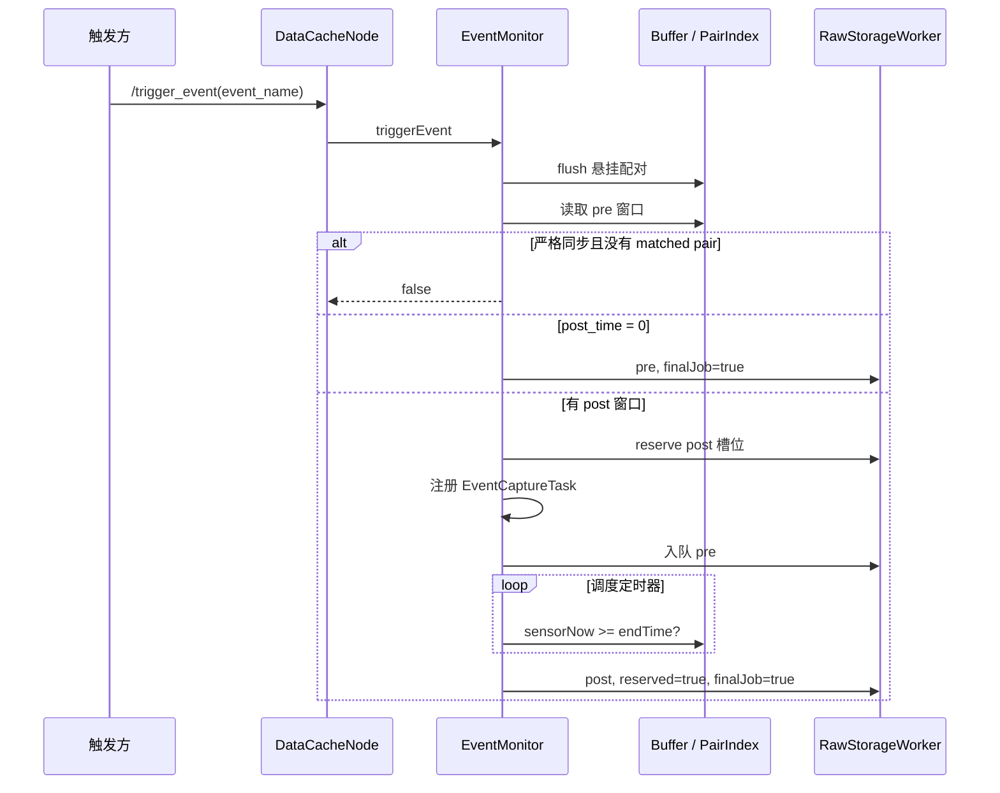

触发时最关键的代码是时间域选择与 post 槽位预约：

```cpp
// include/event_monitor.hpp
bool recordDataAroundEvent(const std::string& eventName) {
    if (flushPendingPairs_) flushPendingPairs_();

    const auto wallNow = clock_->now();
    const auto sensorNow = dataBuffer_->latestSensorTimestamp();
    const auto eventTime = sensorNow.value_or(wallNow);
    const auto startTime = eventTime -
        rclcpp::Duration::from_seconds(preSeconds);

    auto preWindowPairs =
        pairIndex_->getDataWithinTimeRange(startTime, eventTime);
    if (requireSyncedData_) {
        const bool hasMatchedPair = std::any_of(
            preWindowPairs.begin(), preWindowPairs.end(),
            [](const PairRecord& record) {
                return record.status == "matched";
            });
        if (!hasMatchedPair) return false;
    }

    if (postSeconds <= 0) {
        return enqueueRecords(eventDirectory, eventName,
            dataBuffer_->getDataWithinTimeRange(startTime, eventTime),
            std::move(preWindowPairs), false, true);
    }

    EventCaptureTask task{
        taskId, eventName, eventTime,
        eventTime + rclcpp::Duration::from_seconds(postSeconds),
        wallNow + rclcpp::Duration::from_seconds(postSeconds) +
            sensorStallGrace_,
        eventDirectory};
    if (!storageWorker_->reserve()) return false;
    activeCaptures_.emplace(task.taskId, std::move(task));

    const auto accepted = enqueueRecords(eventDirectory, eventName,
        dataBuffer_->getDataWithinTimeRange(startTime, eventTime),
        std::move(preWindowPairs));
    // pre 入队失败时，实际实现会删除 task 并释放预约。
    return accepted;
}
```

> 片段中的 `taskId` 生成、日志和失败回滚被省略；可编译的完整实现见
> [`include/event_monitor.hpp`](include/event_monitor.hpp)。

post 窗口同时具备传感器时间和墙钟兜底两个完成条件：

```cpp
const bool postWindowComplete =
    sensorNow.has_value() && *sensorNow >= task.endTime;
if (postWindowComplete || wallNow >= task.wallDeadline) {
    // 从 activeCaptures_ 移出，随后在锁外查询并入队 post 数据
}
```

收割时会删除等于 `eventTime` 的记录，因为 pre 已包含该闭区间边界。

### 3.4 存储线程与落盘协议

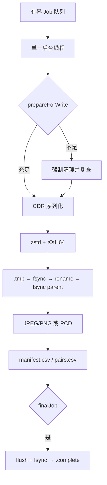

`enqueue` 只移动 Job 到队列；真正的计算和 IO 在 `run()` 所在线程执行。每个 Job 带着
触发时的配置快照，Worker 不需要回头读取 ConfigManager。

```cpp
// include/raw_storage_worker.hpp
void run() {
    while (true) {
        Job job;
        {
            std::unique_lock<std::mutex> lock(mutex_);
            condition_.wait(lock,
                [this]() { return stopping_ || !jobs_.empty(); });
            if (jobs_.empty() && stopping_) return;
            job = std::move(jobs_.front());
            jobs_.pop_front();
        }
        writeJob(job);                 // 锁外执行慢操作
    }
}
```

每条 ROS 消息先序列化为 CDR，再使用复用的 zstd context 压缩。压缩帧显式开启内容校验和。

```cpp
ZSTD_CCtx_setParameter(compressionContext_,
                       ZSTD_c_compressionLevel, job.compressionLevel);
ZSTD_CCtx_setParameter(compressionContext_, ZSTD_c_checksumFlag, 1);
const auto compressedSize = ZSTD_compress2(
    compressionContext_, compressedData.data(), compressedData.size(),
    raw.buffer, raw.buffer_length);
```

final Job 关闭并同步清单后才创建 `.complete`；上传器因而不会看见仍在追加的事件目录。

```cpp
manifest.flush();
manifest.close();
if (job.finalJob) {
#ifndef _WIN32
    syncFile(job.directory / "manifest.csv");
    if (!job.pairs.empty()) {
        syncFile(job.directory / "pairs.csv");
    }
#endif
    writeCompletionMarker(job.directory, job.records.size());
}
```

完整写盘与原子 rename 实现见
[`include/raw_storage_worker.hpp`](include/raw_storage_worker.hpp)，磁盘清理策略见
[`include/disk_space_manager.hpp`](include/disk_space_manager.hpp)。

### 3.5 回传与回读闭环

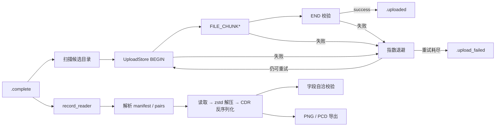

上传候选完全由文件标记决定，存储模块和 UploadWorker 不互相持有对象引用。

```cpp
// include/upload_worker.hpp
if (std::filesystem::exists(directory / ".uploaded") ||
    std::filesystem::exists(directory / ".upload_failed") ||
    !std::filesystem::exists(directory / ".complete")) {
    continue;
}
candidates.push_back(directory);
```

回读校验严格沿写入过程反向执行：文件存在 → 解压 → 反序列化 → 字段自洽。

```cpp
// include/record_io.hpp
if (!loadRecordBytes(eventDirectory, entry, bytes, error)) {
    ++report.failedEntries;
    continue;
}
if (!deserializeMessage(bytes, message, error)) {
    ++report.failedEntries;
    continue;
}
// 随后检查 Image 或 PointCloud2 的尺寸、步长和 data 大小关系。
```

完整实现见 [`include/upload_worker.hpp`](include/upload_worker.hpp)、
[`include/record_io.hpp`](include/record_io.hpp) 和 [`src/record_reader.cpp`](src/record_reader.cpp)。

### 3.6 文件系统状态机

事件目录内的标记文件构成一个**文件系统状态机**，是存储、上传、回读和运维之间的接口：

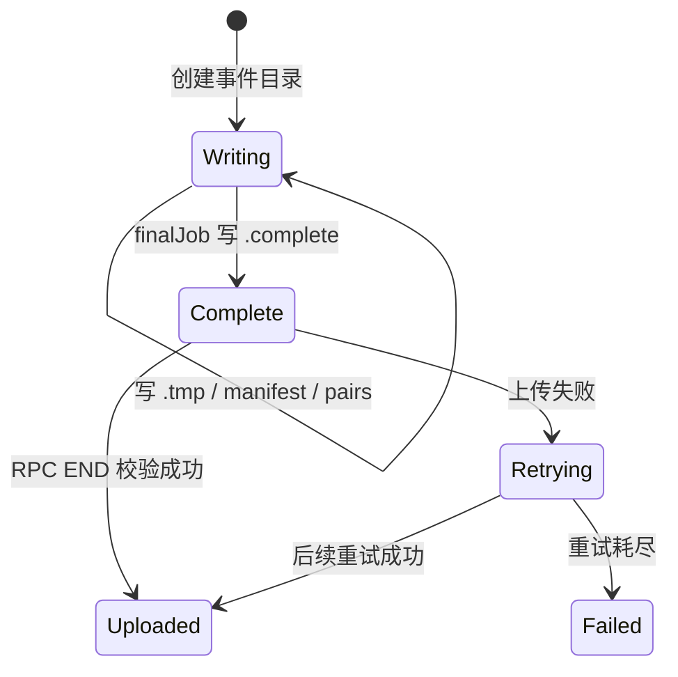

| 标记 | 语义 | 生产者 → 消费者 |
|---|---|---|
| `.tmp` | 写入中，任何读者都应忽略 | RawStorageWorker → 所有读者 |
| `.complete` | 目录内容完整，可回传 | RawStorageWorker → UploadWorker |
| `.uploaded` | 已成功回传（含 service/文件数） | UploadWorker → 运维 |
| `.upload_failed` | 当前一轮重试耗尽；默认延时后自动重排 | UploadWorker → 运维 |

---

## 4. 设计迭代思路

提交历史呈现清晰的分阶段演进：每轮迭代都由一个明确的痛点驱动，且每轮都留下
验证手段（测试/工具），这是本项目最值得复用的方法论。以下按时间线梳理。

### 4.0 阶段零：跑通最小闭环（a47c8de，08-20）

初始提交包含四个节点 + DataBuffer + 事件触发录制的基本骨架。随后 7 个提交全是
构建与运行期修复：

- CMake/ament 安装规则不全导致节点不可执行；
- VTK 经 PCL 传递依赖时 `VTK::mpi` target 缺失（需先 `find_package(MPI COMPONENTS C CXX)`
  并启用 C 语言）；
- 运行目录 ≠ 安装目录，config/pcd 路径改从 package share 解析；
- 空触发请求导致崩溃，改为回落默认 collision 事件；
- **执行器重入崩溃**：服务回调里同步 `spin_until_future_complete`，而节点已在
  执行器中 spin。修复为 `async_send_request` + 完成回调（97e9c45）。
  这一教训直接塑造了 event_trigger_node 的最终形态（2.12 节）。

> 迭代启示：ROS2 + PCL + OpenCV 的交叉构建环境本身就是一个集成难题，
> "先让它在真机/VM 上完整跑起来"是后续一切迭代的地基。

### 4.1 阶段一：异步化存储管线（ba627ef，PR #1）

初版事件录制在回调线程上直接写磁盘。引入 **RawStorageWorker 后台线程 + 有界
Job 队列**：订阅/服务回调只做数据拷贝入队，序列化与 IO 移出热路径，同时加入
zstd 压缩。这是"**热路径最小化**"原则的第一次落地，后续所有模块设计都延续
这一分工（回调入队、后台消费）。

### 4.2 阶段二：同步账本与格式转换（aea9599 + 64a4f45，PR #2）

车载分析需要知道"哪些帧是相机/雷达对齐的"。加入：

- **ApproximateSynchronizer**（±tolerance 时间配对）与 **PairIndex** 账本；
- 事件级配置覆盖（每事件独立窗口与传感器选择）；
- OpenCV/PCL 后台格式转换，产出分析友好副本。

Code review 发现两个典型缺陷并在合入前修复（64a4f45）：

- `tryMatch` 在 `pop_front()` 之后调用 `front()` 读"被丢弃消息的时间戳"，
  实际读到的是下一条消息（队刚空时是 UB）——**先取值再弹出**；
- manifest 的 `.zst` 后缀在写结果确认之前就拼好，压缩失败走 raw 回退时
  清单指向不存在的文件——**写成功后才提交名字**。

> 迭代启示：review 对"指针/迭代器失效后使用"和"错误路径与主路径的状态提交顺序"
> 这两类问题最有效，恰好都是并发 IO 代码的高发区。

### 4.3 阶段三：端到端集成测试（f771505 + 7702dd6，PR #3）

阶段二的合入曾因两处括号缺失直接打破编译（`.string()` 作用于 `std::string`、
成员初始化列表括号不闭合），说明**缺乏自动编译/测试门禁**。本阶段补齐：

- 合成相机发布器（无真实相机也能全链路跑）；
- 集成测试脚本 + `validate_records.py` 结构化断言（manifest/zstd/转换产物/
  pairs 容差/事件级传感器选择）；
- VM 上验证：1013 断言全过。

用于定位该编译错误的一次性脚本（括号平衡扫描等）在后续 a66d11e 中删除——
**调试脚本是耗材，验证脚本是资产**，两者分开对待。

### 4.4 阶段四：车载可靠性三件套（65d239a）

把"演示系统"推向"可部署系统"，针对三个真实失效模式：

1. **时钟偏移** → 事件窗口全面改用传感器时间域（锚定最新 header.stamp），
   post 窗口另设墙钟兜底截止（`sensor_stall_grace_ms`），传感器停滞不再钉死任务。
2. **磁盘耗尽** → DiskSpaceManager：写前检查 + 天数/容量双保留 + 从最旧回收。
3. **传感器断流** → SensorWatchdog（接收时间域），状态附到触发响应；
   加上 `sync_required_for_recording` 严格模式：pre 窗口无配对即拒绝录制。

同时把 datacache.hpp 巨头文件拆为 hpp/cpp 单元——为下一轮可测试性铺路
（EventMonitor 的测试需要链接最小依赖集）。

### 4.5 阶段五：热路径性能（a587fac）

VM 上压测发现两个随规模恶化的点，均以数据结构换算法：

| 问题 | 原实现 | 新实现 | 收益（-O2 实测） |
|---|---|---|---|
| 同步配对 | 每次到达 O(N·M) 双队列全扫描 | front 贪心 + 单调性剪枝 | 摊还 O(1) |
| PairIndex 裁剪 | `vector` 前端 erase，10 万上限处每条 ~10MB 搬移 | `deque` 队首弹出 | ~980x |
| 回调持锁 | PairIndex/日志在同步器锁内执行 | `PendingResults` 锁外派发 | 消除锁竞争 |

DataBuffer 同期改为按传感器分队列 + 水位队首弹出（385x @ cap）。
这一轮确立了"**每条消息的处理成本有平摊上界**"的性能不变量，并在注释中写明了
维持该不变量的前提（到达序 ≈ 时间戳序），防止后人无意破坏。

### 4.6 阶段六：补全写读与回传闭环（cf053fd + 361d037）

系统此前"只写不读、只存不传"，数据落盘后无法验证也无法回流：

- **record_io / record_reader**：回读实现与 CLI（列出/--verify/--export），
  与单测共用同一库——写读对齐由结构保证而非约定保证；
- **UploadWorker + 标记状态机**：`.complete` → multipart POST → `.uploaded` /
  `.upload_failed`，指数退避封顶 64 倍；
- `mock_server.py` 让回传闭环无需外部依赖即可验证；
- 首批 6 个单测套件（30 用例）。

> 迭代启示：`事件目录` 是存储、上传、清理、回读四个模块的**唯一共享契约**，
> 把契约固化成标记文件 + manifest/pairs 格式后，各模块可以独立演进甚至独立部署。

### 4.7 阶段七：存储耐久性（a66d11e，当前 HEAD）

最后一轮针对"数据写着写着就没了/坏了"的静默失效，全部是**顺序与校验**问题：

- **fsync 顺序**：数据文件先 fsync 再 rename、rename 后同步父目录项——rename 只
  保证原子可见，不保证数据块先于目录项持久化，掉电会留下"标记完整内容为空"的文件；
- **`.complete` 后置**：必须在 manifest flush + fsync 之后写入；final Job 带有配对时
  同步 pairs（2.7 节；pre-only pairs 的剩余边缘情况见第 5 章）；
- **XXH64 校验和**：zstd 默认不写帧校验，静默位腐要等到下游分析失败才暴露；
- **撕裂行降级**：崩溃残留的半行 CSV 从抛异常改为记入 problems，`--verify`
  对其返回失败——校验工具自己不能是崩溃源；
- **eventTime 边界去重**：post 批剔除边界帧，消除重复文件与 manifest 重复行；
- 测试从 24 增至 46（EventMonitor 套件把 `processExpiredCaptures` 设为 public
  作为测试缝合点，DiskSpaceManager 套件从临时 harness 移植转正）。

### 4.8 阶段八：HTTP 回传迁移为 ROS2 RPC（当前工作区）

原回传链路使用 libcurl multipart，接收端是独立 HTTP 协议。当前改为
`datacache/srv/UploadStore`：发送端对每个目录执行 BEGIN、逐文件 FILE_CHUNK、END；
接收节点在暂存目录校验文件数与总字节数，通过后再发布最终目录。原有候选扫描、
指数退避以及 `.uploaded/.upload_failed` 文件状态机保持不变，因此传输机制变化没有
扩散到 EventMonitor、RawStorageWorker 或 DiskSpaceManager。

这一改造删除 libcurl 依赖，让触发和回传统一走 ROS2 服务/DDS，也引入明确取舍：
服务调用是逐块请求/响应，吞吐受 DDS 消息大小与往返延迟影响；跨公网不再由 HTTP URL
直接解决，而需要 DDS Router/VPN/网关及 DDS Security。RPC 单测使用进程内服务覆盖
分块、空文件、拒绝、后台扫描、重试终态和指数退避。

### 4.9 贯穿各阶段的迭代原则

1. **热路径最小化**：回调线程只入队；序列化/压缩/IO/网络全部后台线程化。
2. **时钟域显式分离**：传感器域切窗口，单调钟管新鲜度、退避与节流，节点时钟管
   post 兜底和目录命名，系统墙钟管目录年龄；启用仿真时间时必须特别处理后两者的差异。
3. **文件系统即状态机**：`.tmp/.complete/.uploaded/.upload_failed` 是跨模块契约，
   原子写 + fsync 保证状态迁移本身可信。
4. **写读闭环**：任何落盘格式必须有配套回读实现与损坏检测，且二者共享代码。
5. **故障显式建模**：队列满丢弃计数、预约槽位、看门狗、墙钟兜底、磁盘保留、
   重试终态——每种失效都有名字、有日志、有标记，而不是静默吞掉。
6. **每轮迭代留下验证资产**：单测/集成测试/冒烟脚本/mock 接收端，一次性调试
   脚本用完即删。
7. **测试缝合点前置设计**：核心调度函数 public 化、Worker 参数全量注入，
   让测试不依赖定时器被 spin 到这类时序运气。

---

## 5. 已知限制与可能的下一步

与 README「已知限制」一致，同时是下一轮迭代的自然候选：

- 回传是自定义的 ROS2 RPC 分块协议，单块默认 512 KiB；大目录不会整包驻留内存，
  但每块都等待一次响应，长距离链路吞吐受 RTT 影响。生产跨网段部署需补 DDS Router、
  VPN/网关和 DDS Security；当前已有持久化 `transfer_id` 支持安全整段重传，但还没有
  QUERY/偏移协商式断点续传。
- 视频片段为逐帧图像，无 h264/h265 编码；`pointcloud_format` 仅支持 pcd。
- DataBuffer 的 `getDataWithinTimeRange` 仍是线性扫描（仅事件时调用，不在热路径）；
  若窗口查询频度上升可加有序索引。
- 接收端已限制单事务文件数、总字节数、并发数与空闲时间，但节点自身不替代 DDS Security；
  生产环境仍必须配置身份、访问控制和传输加密。
